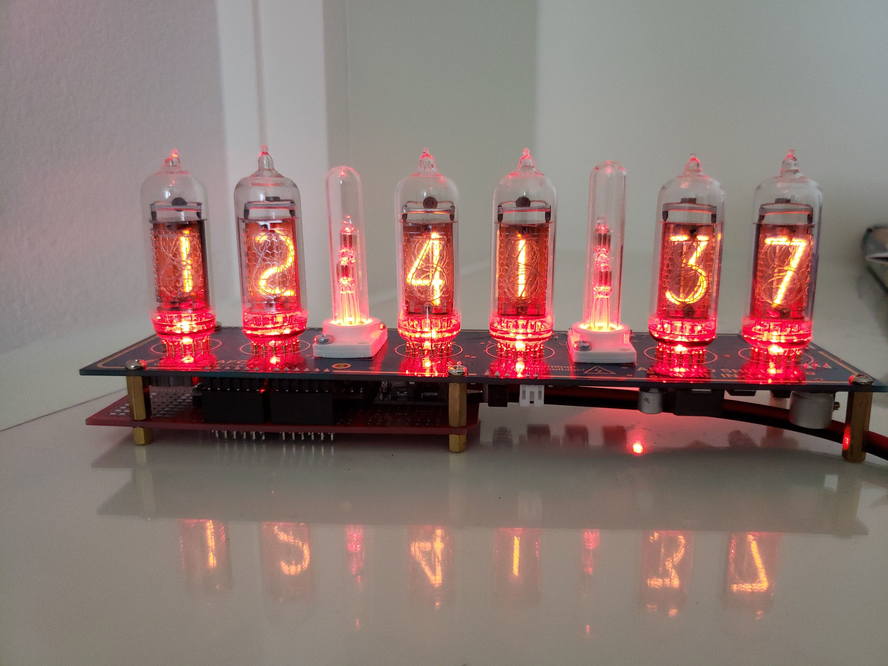

# ESP32 NTP Nixie Tube Clock Controller

This hardware/software combination implements a Nixie tube digital clock that
never needs setting as it gets the current time and date by polling
Network Time Protocol (NTP) servers on the Internet. The clock's time
is synchronized to NTP time periodically. Use of the TimeZone
library means that Daylight Savings Time (DST) is automatically
taken into consideration so no time change buttons are necessary.
Clock can run in 24 hour or 12 hour mode.

This program uses the WiFiManager library to allow WiFi credentials to be set
via a web interface.

How it works:

When the program is first started it creates a wireless access point called NixieClock
that the user needs to connect to and then if the user points his/her browser to
192.168.4.1, a page is presented that allows the credentials for the actual WiFi network
to be entered. This only needs to be done once since the credentials will be stored in
EEPROM and will be used from that point forward.

Once WiFi connection has been established, it uses NTP to initialize the real-time clock (RTC).
If ESP32 cannot connect to the WiFi network using the stored crecentials, it will fall back
to the real-time clock (RTC).

Press the mode button to enter WiFi AP configuration mode.
Long-press the mode button to reset the ESP32.

The hardware consists of the following parts:
  ESP32
  Nixie Tubes Clock Arduino Shield NCS314 for xUSSR IN-14 Nixie Tubes (https://gra-afch.com)

The connections between the ESP32 board and the Nixie Clock Shield are as follows:

ESP32 Pin    Shield Pin          Function
--------------------------------------------------------------------
    GIOP18        SCK        SPI Clock
    GIOP23        MOSI       Master Out Slave In (data from ESP32->clock)
    SS            LE         Latch Enable
    A18           DOT1       Neon dot 1
    A18           DOT2       Neon dot 2
    A16           PWM1       Green LED drive
    A14           PWM2       Red LED drive
    A13           PWM3       Blue LED drive
    17            SHTDN      High voltage enable
    A15           SET        Set (mode) button
    16            UP         Up button
    A10           DOWN       Down button
    A4            BUZZER     Buzzer pin

The ESP32 is powered (via Vin) with 5VDC from a 5 volt regulator driven from
the 12 VDC supply. The shield is powered directly from the 12 VDC supply.

Based on ESP8266_NTPNixieClock by Craig A. Lindley and NixeTubesShieldNCS314 by GRA & AFCH.
